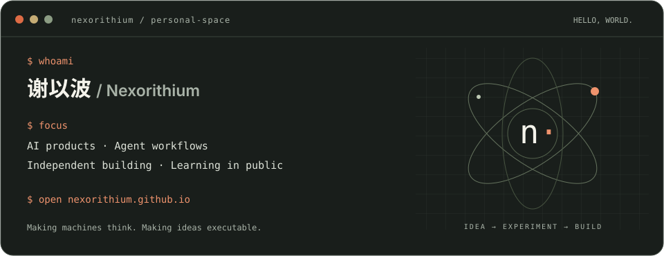

# Hi, I'm 谢以波 👋

点击终端卡片，进入我的个人网站 ↗

也可以叫我 **Nexorithium**。我关注 AI、产品与独立开发，喜欢把一个问题拆开研究，再把想法做成可以尝试的东西。

从 Agent 工作流、知识整理工具，到交互原型与阅读体验，这里记录我的探索与实践。

**Making machines think. Making ideas executable.**

[个人网站 ↗](https://nexorithium.github.io/) · [全部项目 ↗](https://github.com/nexorithium?tab=repositories)

---

## Selected projects / 项目

| 项目 | 在做什么 |
| :--- | :--- |
| [**Feishu Note Organizer**](https://github.com/nexorithium/codex-feishu-note-organizer) | 将课程转写、会议记录与学习资料整理为结构清晰、重点突出的中文笔记。`Codex Skill` |
| [**Product Evidence Deconstruction**](https://github.com/nexorithium/product-evidence-deconstruction) | 基于截图、网站或源代码拆解 AI 产品，生成证据可追溯的 HTML 报告。`Codex Skill` |
| [**紫禁问迹**](https://github.com/nexorithium/zijincheng-ai-game) | 融合故宫建筑知识、环境解谜与 AI 史官对话的第一人称 3D 网页探索原型。`Prototype` |
| [**此刻一页**](https://github.com/nexorithium/cike-yiye) | 结合古典文学原文、情境匹配与 AI 解读的中文阅读体验。`MVP` |
| [**Personal Website**](https://github.com/nexorithium/nexorithium.github.io) | 收纳项目、文字与探索的个人空间，使用轻量静态页面搭建。`Web` |

## Writing / 文章

文章写在微信公众号，索引正在整理。后续会在[个人网站的 Writing 区](https://nexorithium.github.io/#writing)收录原文链接。

## About / 关于

- **AI 与产品**：关注技术如何进入真实场景，变成有用的体验。
- **Agent 工作流**：探索知识整理、信息分析与可复用的技能。
- **独立创造**：从小工具和原型出发，让想法逐步落地。
- **持续学习**：在实践中记录问题、修正判断，也分享过程。

欢迎围绕 AI、产品和有意思的想法交流；项目相关的问题或建议，可以在对应仓库发起 Issue。

---

Stay curious. Keep building. · 谢以波 / Nexorithium
